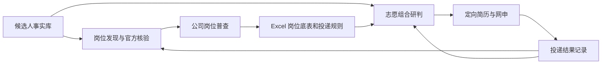

# Campus Application Agent Workflow

一个用于校园招聘的多 Skill Agent 工作流。它把候选人资料、岗位发现、公司岗位普查、志愿决策、定向简历和网申串成连续流程，让每一步都有可追溯的输入、交付物和下一步动作。

我使用 Codex 等 Agent 工具设计并持续迭代这套流程。六个 Skill 分别处理事实维护、跨公司搜索、单家公司岗位普查、志愿组合、申请填写和进度规划；浏览器工具用于访问招聘页面，Python 脚本辅助岗位去重和结果检查。

## 项目背景

校园招聘的信息散落在公司官网、招聘系统、公众号和申请页面。同一家公司可能有多个招聘入口，岗位会变动；每次申请又需要核对个人经历、职位要求和志愿限制。

我把这些重复工作拆成可交接的环节：搜索阶段保存来源和覆盖进度，普查阶段产出完整岗位底表，研判阶段依据候选人背景与招聘规则选择志愿，申请结果再进入下一轮规划。一条岗位线索可以追溯到官方依据、申请判断和后续状态。

## 流程与交付物



| Skill | 职责 | 交付物 |
| --- | --- | --- |
| `build-candidate-profile-and-resume` | 建立候选人事实库，按职位调整简历 | 事实库、定向简历 |
| `find-non-sales-campus-jobs` | 跨渠道发现岗位，核验官方来源并持续查漏 | 岗位表、覆盖状态、学习规则 |
| `company-job-census` | 遍历指定公司当届岗位和投递规则 | 完整 Excel 底表、规则记录 |
| `application-portfolio-strategy` | 在资格、名额和限投约束下选择志愿 | 正式志愿、补充池、替换条件 |
| `complete-campus-applications` | 将可信事实转成申请页面所需内容 | 字段文案、页面复核结果 |
| `plan-autumn-recruitment` | 根据投递与测评进展调整行动顺序 | 近期任务与进度记录 |

### 岗位普查 → 志愿研判

`company-job-census` 保存岗位编号、机构、城市、人数、完整职责、资格、状态、链接和采集时间，并核实限投与志愿规则。`application-portfolio-strategy` 读取完整底表，比较岗位价值、现实竞争位置和组合中的新增机会，形成正式志愿与替换方案。[查看交接示例](examples/decision_handoff.md)。

### 查漏反馈 → 下一轮搜索

用户提供的新岗位进入官方核验，再与历史基线比较。搜索 Skill 按公司池、别名、关键词、渠道、动态 ATS 和时间窗口等原因定位漏项，把可复用修正写入 `learning_rules`，在下一轮检索中应用并记录命中情况。

## 迭代实践

- 多城市搜索采用结构化状态记录覆盖范围、断点和待复核项。一次六城搜索合并去重形成 **161 条岗位记录**；后续五城查漏新增 **54 条记录**。两项数字分别描述各自批次。
- 单家公司研究形成两阶段流程：先普查完整岗位供给和招聘规则，再结合候选人背景设计志愿组合。底表与方案通过岗位编号和来源相互对应。
- 搜索规则随着实际漏检持续修订。例如，增量检查同时比较发布日期与历史基线成员，识别较早发布但此前尚未收录的岗位。
- 工作区维护定向简历、网申填写包、投递记录及本地检索模块，让新任务能重新找到已核实的事实和判断依据。

## 快速体验

每个 `skills/<skill-name>/SKILL.md` 描述触发场景、执行步骤与交付格式。将需要的 Skill 文件夹放入支持 Agent Skills 的工具目录，在本地工作区建立候选人事实库，即可按上述流程使用。浏览器、文档和表格工具由运行环境提供。

仓库附有虚构岗位输入，可直接运行岗位规范化脚本：

```bash
python skills/company-job-census/scripts/normalize_jobs.py examples/synthetic_jobs.json --expected-count 2 -o normalized.json
```

示例含 3 条原始记录，其中一个岗位重复；脚本输出 2 个唯一岗位，并检查与预期数量是否一致。`skills/find-non-sales-campus-jobs/scripts/validate-job-results.py` 可检查岗位表字段、来源和覆盖状态，输入格式见对应的 [`output-schema.md`](skills/find-non-sales-campus-jobs/references/output-schema.md)。

## 仓库结构

```text
skills/       六个 Skill 的指令、参考规则和辅助脚本
examples/     虚构岗位输入与志愿研判交接示例
README.md     项目说明和运行入口
```

公开仓库提供流程与演示数据。真实候选人资料和申请记录保存在本地工作区；实际使用时按当届官方招聘页面核对岗位状态和投递规则。

## License

[MIT](LICENSE)
