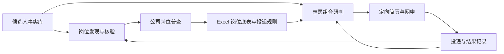

# Campus Application Agent Workflow

一个用于校园招聘的多 Skill 工作流：从候选人事实建档、岗位发现与官方核验，到单家公司岗位普查、志愿组合研判、简历定制、网申填写和结果回流。项目以中文为主要工作语言。

> 这是工作流与辅助脚本的公开版本。它不会自动保证岗位覆盖、录用结果或申请提交；招聘事实仍需以当届官方页面核实，申请由候选人复核。

## 工作流



| Skill | 职责 | 主要交付 |
| --- | --- | --- |
| `build-candidate-profile-and-resume` | 建档、维护事实与定向简历 | 事实库、简历 |
| `find-non-sales-campus-jobs` | 多渠道发现、官方核验、查漏 | 岗位表、覆盖状态、学习规则 |
| `company-job-census` | 遍历指定公司当届官方岗位与规则 | 完整 Excel 底表、交接提示 |
| `application-portfolio-strategy` | 依据底表和候选人背景设计志愿组合 | 正式志愿、补充池、替换条件 |
| `complete-campus-applications` | 生成并检查网申字段内容 | 填写内容、页面复核 |
| `plan-autumn-recruitment` | 根据投递结果调整优先级 | 下一步行动与进度 |

## 如何使用

1. 将需要的 `skills/<skill-name>` 文件夹放到支持 Agent Skills 的工具所识别的 Skill 目录中。每个文件夹的 `SKILL.md` 是入口，`references/` 和 `scripts/` 是配套资源。
2. 在**私有工作区**建立候选人事实库和申请记录。请勿把真实简历、联系方式、证件信息、登录信息或招聘网站会话文件提交到公开仓库。
3. 先调用建档 Skill；跨公司搜索调用 `find-non-sales-campus-jobs`。研究某一家公司的全部岗位时调用 `company-job-census`，再把完整底表交给 `application-portfolio-strategy`。
4. 定向简历和网申使用已核实的事实；最终投递由本人复核。不同网站需要的浏览器、文档和表格工具应在本地单独配置。

## 可运行脚本

`company-job-census/scripts/normalize_jobs.py` 可将从官方页面提取的 JSON 岗位记录规范化并去重：

```bash
python skills/company-job-census/scripts/normalize_jobs.py examples/synthetic_jobs.json --expected-count 2 -o normalized.json
```

`find-non-sales-campus-jobs/scripts/validate-job-results.py` 用于检查该 Skill 约定的岗位结果格式和覆盖状态。它需要符合 `skills/find-non-sales-campus-jobs/references/output-schema.md` 的结果文件。

## 迭代方式

搜索结果与历史基线比较；对新增线索先回官方来源核验，再区分公司池、别名、关键词、渠道、动态 ATS、时间窗口等漏检原因。可复用的修正进入搜索状态中的 `learning_rules`，下一轮加载并记录命中情况。公司普查保留分页、分面和岗位 ID 的覆盖证据；志愿研判保留硬资格、招聘人数、机构限制与替换条件。

`examples/synthetic_jobs.json` 是虚构输入，只用于演示脚本；`examples/decision_handoff.md` 展示底表如何交接给志愿研判，不包含真实候选人资料。

## 项目范围

本仓库公开流程、规则与辅助脚本。原始工作区中多城市搜索、公司普查、Word/Excel 方案和本地浏览器操作产物含个人申请信息或时效性招聘数据，因此不在公开版中分发。这个项目展示的是 AI 辅助信息核验与决策流程；未声称直接开展广告投放或实现量化营销增长。

## License

MIT。见 [LICENSE](LICENSE)。
